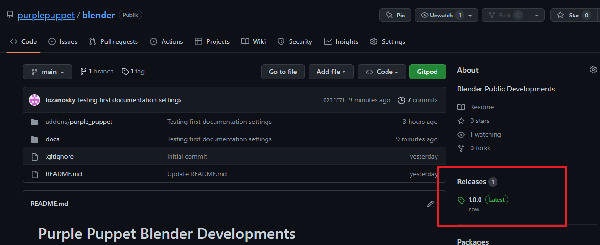
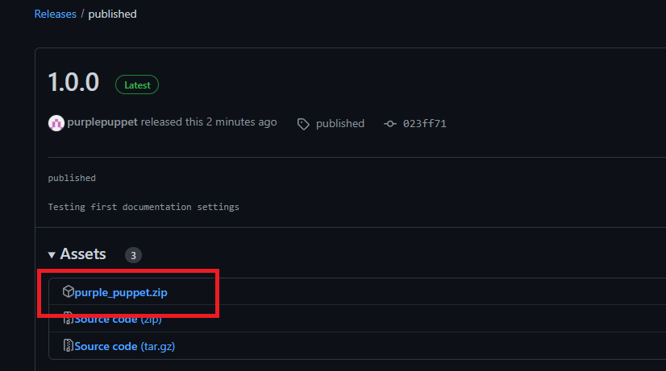
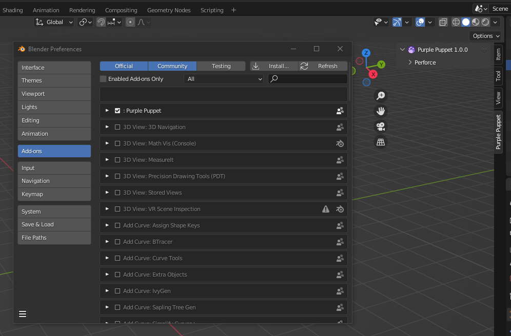

1. How to install
=================

To install the Purple Puppet Tools Addon in Blender you have to do it as any other addon, downloading first the latest released version from our git repository (https://github.com/purplepuppet/blender):

After that, go to File → Preferences → Addons, click on the Install button, and select the addon zip file.11.. image:: images/02.png

Now you will be able to see the addon installed and the panel on the right sid1.

