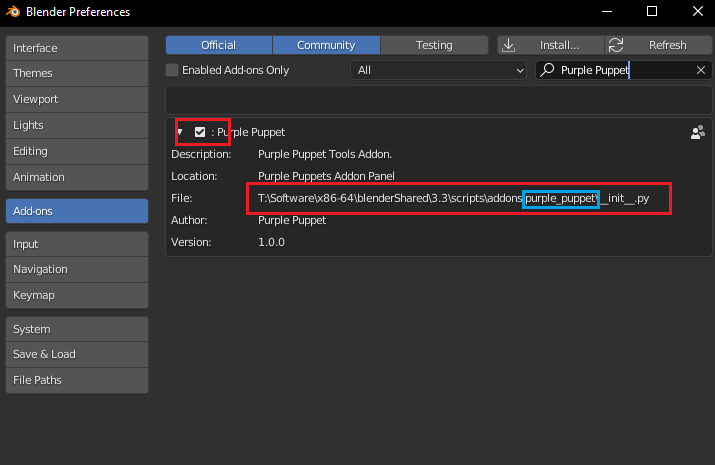

3. How to uninstall
===================

To uninstall the Purple Puppet addon you have to go to File → Preferences → Add-ons, and uncheck the addon. After that, you can also navigate to the Blender addons path, and remove the “purple_puppet” folder manually:

