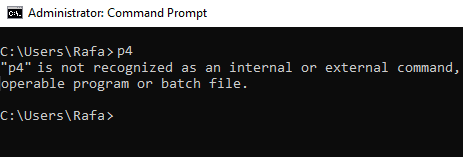
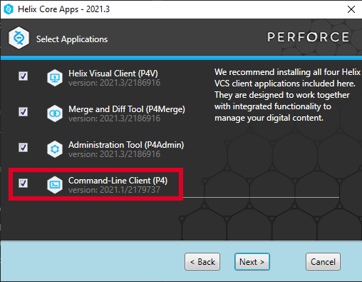
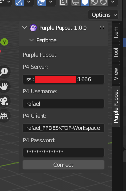
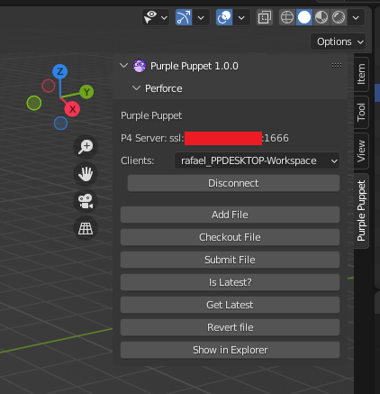
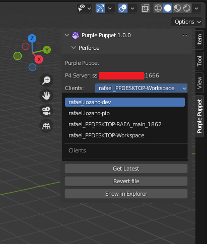
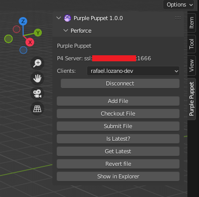

2. Perforce
===========

2.1 Introduction
++++++++++++++++

The Perforce tools allow you to connect to your P4 server, and a bunch of features which will allow you to work faster. Between others you will be able to switch between different workspaces, checkout files or download the latest version of your current scene.

2.2 Requirements
++++++++++++++++

To be able to use the Perforce tools, it's mandatory to have installed the P4 command line option. To check if you have it installed, you can open a windows terminal, write “p4” (without quotes) and press enter:

If the command is not recognized (as you can see in the screenshot), you have to install it. Otherwise, if the message is different, you can skip this and continue with the next point.

To install the P4 command line option, you only need to open the P4 client installer, and check the next option.

Once you have checked it, you can click on Next to continue with the installation.

2.3 How to use
++++++++++++++

2.3.1 Login / Logout
--------------------

The initial view of the Perforce tools in Blender will be a panel where you can login in your Perforce server. To get logged in, you have to introduce the P4 server, username, client and password.

Once you have introduced it, click on the Connect button, and the UI will change.

You can now click on the Disconnect button to get disconnected from the server.

2.3.2 Client Switch
-------------------

If you want to change the current client where you are working on, you only need to open the Clients list, and select the new one:

Once you select the new one, it will change the current client automatically.

2.3.3 Tools
-----------

The Purple Puppet Perforce Tools are a set of utilities that can speed up our work. Let’s see how they work:

* **Add File:** This button allows you mark the current scene to be added on Perforce.
* **Checkout File:** This button allows you to checkout the current scene.
* **Submit File:** This allows you to submit the current file to P4. Be sure to have it marked for add or checked out before submitting the file or it will give you a warning message.
* **Is Latest?:** This button will allow you to check if the current scene is in the latest version.
* **Get Latest:** This button will allow you to download the latest version of the current scene. It will show you a question warning message because you could lose your current local changes.
* **Revert File:** Similar to the get latest button, it will restore the current scene file with the original status on Perforce.
* **Show in Explorer:** This button will allow you to open a windows file explorer in the current scene opened path.

